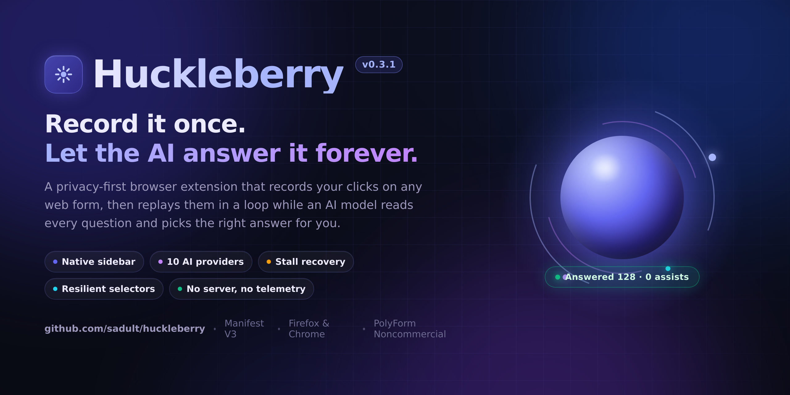
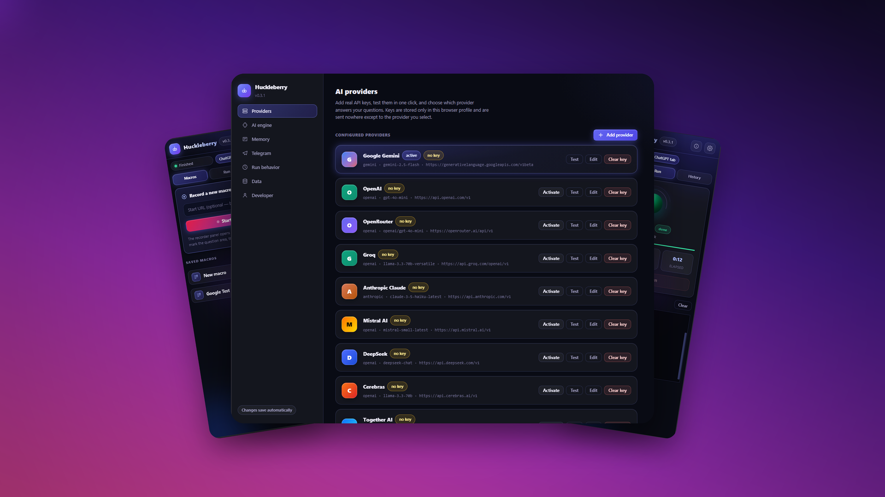

<div align="center">


# Huckleberry

### Record it once. Let the AI answer it forever.

**A privacy-first browser extension that records your clicks on any web form, then replays them in a loop while an AI model reads each question and picks the right answer for you.**

[](CHANGELOG.md)
[](manifest.json)
[](docs/INSTALL.md)
[](docs/INSTALL.md)
[](LICENSE)

[Install](#-installation) &nbsp;·&nbsp; [Quick start](#-quick-start) &nbsp;·&nbsp; [How it works](#-how-it-works) &nbsp;·&nbsp; [Providers](#-ai-providers) &nbsp;·&nbsp; [Docs](#-documentation) &nbsp;·&nbsp; [Troubleshooting](#-troubleshooting)

</div>

<div align="center">



<sub>The Huckleberry sidebar — compact macro rows, a live run panel with the AI orb, and a streaming activity log.</sub>

</div>

---

## 🎯 What is Huckleberry?

Huckleberry is a **macro recorder and automatic answering assistant** for the browser. It solves a very specific and very tedious problem: web pages that ask you the same kind of question over and over — questionnaires, surveys, quiz banks, review queues, data-labelling tasks, onboarding wizards, practice-exam engines and internal admin tools that were never given a bulk-edit button.

The workflow has three acts:

| Act | What you do | What Huckleberry does |
| :-- | :-- | :-- |
| **1. Record** | Click through one single question exactly the way a human would. | Watches every click, keystroke and navigation, and stores a resilient selector for each target. |
| **2. Describe** | Tell it where the question text lives and which element is the answer. | Turns your clicks into a typed step list (`extract` → `ask_ai` → `choose_answer`) you can inspect and edit. |
| **3. Run** | Press **Run** and walk away. | Loops the macro: reads each question, sends it to your AI provider, selects the matching answer, submits, and moves to the next one — logging every action live. |

What makes it different from a generic click-replay tool is the `ask_ai` step. A classic macro recorder is blind: it replays coordinates and fails the moment the content changes. Huckleberry **reads the page** at run time, hands the extracted question to a language model, and matches the returned answer against the options actually present on screen. The macro describes the *shape* of the task; the AI supplies the *content*.

> **Design principle — your keys, your traffic, your data.** Huckleberry has no backend, no telemetry, no account and no sign-up. Macros and settings live in your browser's local extension storage. Prompts travel directly from your browser to the AI endpoint you configured, using the API key you supplied. There is no middle server, ever.

---

## 👥 Who it is for

- **Researchers and students** running the same evaluation form across hundreds of items.
- **QA engineers** who need a form filled repeatedly with realistic, varying answers instead of static fixtures.
- **Data labellers and annotators** working through long queues of near-identical prompts.
- **Operations teams** stuck with legacy internal tools that have no bulk actions or API.
- **Anyone** who has ever thought *"I am the API for this website and I resent it."*

Huckleberry is deliberately **not** a captcha solver, not a credential stuffer, and not a traffic generator. See the [disclaimer](#-acknowledgements-and-disclaimer).

---

## ✨ Feature tour

### Recording and macros

- **Visual recorder overlay** — a floating panel injected into the page (inside a shadow DOM, so it can never collide with the site's own CSS) that shows every captured step live as you click.
- **Resilient selector engine** — for each element it builds a ranked list of strategies: `id`, `data-*` attributes, `aria-label`, `name`, visible text, and a structural CSS path as the last resort. At run time the strategies are tried in order, so a macro survives class-name churn and re-rendered markup.
- **Typed step list** — eleven distinct step types (see the [table below](#-the-recorder-and-step-types)) rather than raw coordinates. Steps are readable, reorderable data, not an opaque blob.
- **Loops and restart points** — mark where one question ends and the next begins with `restart_point`, or wrap a block in `loop_start` / `loop_end`. A run can iterate until the page runs out of questions or until `maxLoops` is reached.
- **Batch add** — capture a group of similar answer options in one gesture instead of clicking each one.
- **Draft recovery** — an in-progress recording is continuously mirrored to storage, so an accidental tab close or a background-worker restart does not throw away your work.
- **Full macro management** — run, run *questions only* (skip the navigation preamble), rename, duplicate, delete, export and import, all from compact single-row cards in the sidebar.

### AI answering

- **Ten built-in providers** with correct base URLs and sensible default models — Gemini, OpenAI, OpenRouter, Groq, Anthropic, Mistral, DeepSeek, Cerebras, Together and local Ollama.
- **A real provider manager** — add, edit, activate, test and delete providers from a dedicated settings page. Every provider can be probed with a one-click **Test connection** that reports the round-trip latency in milliseconds and the exact error text on failure.
- **Any OpenAI-compatible endpoint** works out of the box — point a custom provider at any base URL that speaks `/chat/completions`.
- **Two answer engines** — call an **API** directly, or drive an already-signed-in **web chat tab** (Gemini or ChatGPT) when you would rather not use API credits.
- **Constrained answering** — the model is not asked an open question. It receives the extracted question plus the exact list of options present on the page, and is instructed to reply with one of them, which keeps answers matchable.
- **Timeouts and retries** — per-request timeout and retry count are configurable, so a single flaky response cannot wedge a two-hour run.

### Reliability

- **Stall detection with manual assist** — the headline fix of the 0.3.x line. If the answer engine stops responding (very common with web-chat tabs after a handful of turns), the run pauses, notifies you, shows the stuck question in the sidebar, waits for you to type the answer by hand, applies it, and then **resumes the loop automatically from exactly where it stopped**.
- **Tab recycling** — in Tab mode the chat tab is closed and reopened every *N* questions, which pre-empts the memory creep and silent throttling that cause long-session freezes.
- **Keep-alive** — the MV3 service worker is pinged during a run so the browser cannot suspend it mid-loop.
- **Normalised messaging layer** — every background response is guaranteed to carry a success flag, so a successful operation can never be silently misread by the UI as a failure.
- **Confirmation gates** — insert a `confirm_restart` step and the run will pause and ask before it commits something consequential.
- **Live activity log** — colour-coded, timestamped, scrollable, exportable. When something goes wrong you get the reason in plain English, not silence.

### Interface

- **Native sidebar** — Huckleberry lives in the browser's side panel, so it stays open beside the page it is automating instead of closing every time you click.
- **Animated AI orb** — a live status indicator that breathes while idle, spins while running, glows amber while waiting for your assist, and turns red on error. Status is legible from across the room.
- **Three focused tabs** — Macros, Run, History.
- **Run statistics** — questions answered, manual assists used, and elapsed time, updating live.
- **Full-page settings** with seven sections: Providers, Engine, Memory, Telegram, Run, Data, About.
- **Telegram bridge** — get a message on your phone when a run finishes, fails, or needs your help.
- **English-only interface** with a dark, glassy aurora theme and rounded, accessible controls.

---

## 🖼 Screenshots and interface

<div align="center">

</div>

The extension surface is split across four contexts:

| Surface | File | Purpose |
| :-- | :-- | :-- |
| **Sidebar** | `sidebar/sidebar.html` | The primary interface. Macro list, run control, live log, history. |
| **Recorder overlay** | `content/recorder.js` | Injected into the target page while recording. Shadow-DOM isolated. |
| **Settings page** | `options/options.html` | Providers, engine, memory, Telegram, run tuning, data tools, About. |
| **Background worker** | `background.js` | The orchestrator. Owns all state, storage, AI calls and the run loop. |

### The sidebar tabs

**Macros** — the recording launcher (a URL field plus **Record**), Export / Import buttons, and one compact row per macro. Each row shows an icon tile, the macro name, its step count and creation date, a small **Run** button, and four icon-only actions: *Questions only*, *Rename*, *Duplicate*, *Delete*.

**Run** — the animated orb, a status badge, the current step description, three live counters (Answered / Assists / Elapsed), a **Stop** button, the confirmation box, the manual-assist box, and the streaming activity log with a **Clear** action.

**History** — a persistent record of completed runs with their outcomes, clearable in one click.

---

## 📦 Installation

Huckleberry is distributed as an unpacked extension and as ready-to-load zip archives. It is **not** on the Chrome Web Store or addons.mozilla.org, so installation is manual and takes about thirty seconds.

### Requirements

- **Firefox 115+** (the sidebar uses `sidebar_action`), or **Chrome / Edge / Brave / Opera** with Manifest V3 support.
- An **API key** from at least one AI provider — or a browser already signed in to Gemini or ChatGPT if you plan to use Tab mode. A free Gemini key from Google AI Studio is enough to get started.

### Firefox — temporary install (recommended for trying it)

```bash
git clone https://github.com/sadult/huckleberry.git
cd huckleberry
```

1. Open `about:debugging#/runtime/this-firefox`.
2. Click **Load Temporary Add-on…**.
3. Select the `manifest.json` file in the project root.
4. Open the sidebar: **View → Sidebar → Huckleberry**, or click the toolbar icon.

> A temporary add-on is removed when Firefox restarts. For a permanent install, build a signed package or use Firefox Developer Edition / Nightly with `xpinstall.signatures.required` set to `false`.

### Chrome, Edge, Brave and Opera

Chromium browsers need the Chromium manifest, which the build script puts in place for you:

```bash
./build.sh          # produces dist/huckleberry-chrome.zip
```

1. Unzip `dist/huckleberry-chrome.zip` into a folder you will keep.
2. Open `chrome://extensions` and enable **Developer mode** (top right).
3. Click **Load unpacked** and select that folder.
4. Pin the toolbar icon, then click it to open the side panel.

If you prefer not to run the script, copy `manifest.chrome.json` over `manifest.json` before loading.

### Verifying the install

Open the sidebar. You should see the version chip reading **0.3.1**, the orb breathing gently, and the status strip showing **Idle**. If the macro list says *"No macros yet"*, everything is wired correctly.

Full platform notes, signing guidance and update instructions live in **[docs/INSTALL.md](docs/INSTALL.md)**.

---

## 🚀 Quick start

### Step 1 — Add an AI provider

Open **Settings → Providers**, click **Add provider**, and choose **Google Gemini** from the preset dropdown. The base URL and model (`gemini-2.5-flash`) are filled in for you; paste your key from [Google AI Studio](https://aistudio.google.com/apikey), then press **Test connection**.

A green result with a latency figure means you are ready. A red result shows the provider's own error message — almost always an invalid key, an unavailable model name, or no network. Press **Save**, then **Activate** the provider so runs use it.

### Step 2 — Record a macro

1. Go to the **Macros** tab, paste the URL of the page holding your questions, and press **Record**.
2. Huckleberry opens the page and injects the recorder overlay.
3. Click through **exactly one** question the way you normally would.
4. Use the overlay buttons to mark the special steps:
   - **Extract** on the element containing the question text.
   - **Ask AI** to insert the model call.
   - **Choose answer** on the answer control (radio group, dropdown, or option list).
   - **Restart point** where the next question begins.
5. Name the macro and press **💾 Save macro**. The panel closes and your macro appears in the sidebar immediately.

### Step 3 — Run it

Press **Run** on the macro row. The view switches to the **Run** tab, the orb spins up, and the log starts streaming:

```
Starting "Course evaluation" with Google Gemini · gemini-2.5-flash
Extracting the question text…
Asking Google Gemini…
Answer: "Strongly agree" · matched option 4/5
Submitting and moving to the next question…
Answered 1 · returning to the restart point
```

Press **Stop** at any time. If the engine stalls, the orb turns amber and the assist box asks you for that one answer — type it, press **Send answer**, and the loop continues by itself.

---

## 🔍 How it works

```
┌────────────────────────────────────────────────────────────────────────────┐
│  SIDEBAR  (sidebar/sidebar.js)                                             │
│  macro list · run control · live log · history                             │
└───────────────┬───────────────────────────────────────▲────────────────────┘
                │  runtime.sendMessage({ cmd })         │  hb-events broadcast
                ▼                                       │  (log · run · progress
┌────────────────────────────────────────────────────────┴───────────────────┐
│  BACKGROUND WORKER  (background.js)  ·  the single source of truth         │
│                                                                            │
│   ┌── storage ──────┐   ┌── run loop ────────┐   ┌── AI router ─────────┐   │
│   │ macros          │   │ step dispatcher    │   │ API mode  → fetch()  │   │
│   │ settings        │◄─►│ loop + restart     │◄─►│ Tab mode  → bridge   │   │
│   │ history         │   │ stall watchdog     │   │ timeout · retries    │   │
│   │ draft           │   │ assist gate        │   │ provider presets     │   │
│   └─────────────────┘   └─────────┬──────────┘   └──────────┬───────────┘   │
└───────────────────────────────────┼─────────────────────────┼───────────────┘
         tabs.sendMessage           │                         │ direct HTTPS
                ▼                   ▼                         ▼
┌──────────────────────────────┐  ┌────────────────┐  ┌──────────────────────┐
│ CONTENT SCRIPTS (target page)│  │ TELEGRAM BRIDGE│  │ YOUR AI PROVIDER     │
│ selector.js  · find elements │  │ notify on done │  │ Gemini · OpenAI ·    │
│ executor.js  · click / type  │  │ or on assist   │  │ Ollama · any OpenAI- │
│ recorder.js  · capture steps │  │                │  │ compatible endpoint  │
└──────────────────────────────┘  └────────────────┘  └──────────────────────┘
```

### The run loop, step by step

1. **Validate.** Before reporting success, the background worker confirms the macro exists, has steps, that no other run is active, and — in API mode — that the active provider has a usable key. Any failure is returned as a readable reason instead of a silent no-op.
2. **Open the stage.** If the first step is `open_url`, a fresh tab is created and awaited until fully loaded. Otherwise the current active tab is adopted.
3. **Inject.** `selector.js`, `executor.js` and `recorder.js` are injected into the tab, with retries, because a page can still be settling.
4. **Dispatch.** Each step is sent to the content script, which resolves the target element through the ranked selector strategies and performs the action. Results flow back as `progress` broadcasts.
5. **Extract.** An `extract` step pulls the question text (and the visible option labels) into the run's variable bag.
6. **Ask.** An `ask_ai` step builds a constrained prompt — your questionnaire context, then the question, then the exact option list, then the instruction to answer with one of them — and routes it to the active engine under the configured timeout and retry budget.
7. **Answer.** A `choose_answer` step matches the model's reply against the on-page options (exact match first, then normalised, then closest) and clicks it.
8. **Loop.** At `restart_point` the counter increments and control returns to the marked step, until the page has no more questions, `maxLoops` is hit, or you press Stop.
9. **Finish.** The outcome is written to history, the orb settles into its done or error state, and — if enabled — Telegram gets a message.

A deeper, file-by-file walkthrough is in **[docs/ARCHITECTURE.md](docs/ARCHITECTURE.md)**.

---

## 🎬 The recorder and step types

Every macro is an ordered array of typed steps. This is what the executor understands:

| Icon | Type | What it does |
| :--: | :-- | :-- |
| 🌐 | `open_url` | Navigate to a URL. Usually the first step; skipped in *Questions only* mode. |
| 👆 | `click` | Click an element resolved through the selector strategies. |
| ⌨️ | `type` | Type text into an input, textarea or contenteditable element. |
| 📋 | `extract` | Read text from the page into a run variable — this is how the question reaches the AI. |
| 🧠 | `ask_ai` | Send the extracted question plus the available options to the active engine. |
| ✅ | `choose_answer` | Match the model's reply against the on-page options and select it. |
| ⏳ | `wait` | Pause for a fixed duration, for animations or slow XHR. |
| 🔁 | `loop_start` | Open a repeating block. |
| 🏁 | `loop_end` | Close a repeating block. |
| 📍 | `restart_point` | Mark where the next question begins; the loop returns here. |
| 🔔 | `confirm_restart` | Pause and ask you for confirmation before continuing. |

### Recording tips that make macros survive

- **Prefer stable targets.** When a page offers both a styled `div` and a real `input`, click the input — it usually has a `name` or `id`.
- **Extract the narrowest container.** Selecting the whole question card drags navigation chrome and progress text into the prompt and confuses the model. Select the sentence.
- **Place the restart point precisely.** It should sit *after* submission and *after* the next question has rendered — not before.
- **Add a `wait` when the site animates.** 300–800 ms after a submit click removes most flakiness.
- **Record one clean iteration.** A macro that describes a single question perfectly loops beautifully; one that describes two questions sloppily loops badly.

The complete recording guide, with worked examples for radio grids, dropdowns and multi-page wizards, is in **[docs/USER-GUIDE.md](docs/USER-GUIDE.md)**.

---

## 🤖 AI providers

Ten providers ship as presets, each with a working base URL and a default model chosen for speed and cost:

| Provider | Default model | Base URL | Notes |
| :-- | :-- | :-- | :-- |
| **Google Gemini** | `gemini-2.5-flash` | `generativelanguage.googleapis.com/v1beta` | Generous free tier — the recommended starting point. |
| **OpenAI** | `gpt-4o-mini` | `api.openai.com/v1` | The reference OpenAI-compatible API. |
| **OpenRouter** | `openai/gpt-4o-mini` | `openrouter.ai/api/v1` | One key, hundreds of models. |
| **Groq** | `llama-3.3-70b-versatile` | `api.groq.com/openai/v1` | Extremely fast inference. |
| **Anthropic** | `claude-3-5-haiku-latest` | `api.anthropic.com/v1` | Uses Anthropic's native message format. |
| **Mistral** | `mistral-small-latest` | `api.mistral.ai/v1` | European hosting. |
| **DeepSeek** | `deepseek-chat` | `api.deepseek.com/v1` | Very low cost per token. |
| **Cerebras** | `llama-3.3-70b` | `api.cerebras.ai/v1` | Wafer-scale speed. |
| **Together** | `meta-llama/Llama-3.3-70B-Instruct-Turbo` | `api.together.xyz/v1` | Broad open-model catalogue. |
| **Ollama (local)** | `llama3.1` | `localhost:11434/v1` | Fully offline. No API key required. |

### Managing providers

The **Providers** page is a first-class manager, not a single key box:

- **Add** — pick a preset to prefill everything, or define a custom provider by hand.
- **Edit** — change label, model, base URL or key at any time.
- **Activate** — one provider is active for runs; the active card glows.
- **Test** — sends the probe prompt `Reply with exactly: connection ok` and reports either the round-trip time in milliseconds or the provider's verbatim error.
- **Delete** — removes the provider; if it was the active one, the selection resets safely.
- **Peek key** — reveal a stored key when you need to check it.

Each provider card carries a brand-coloured icon tile so you can identify it at a glance.

### Adding a custom endpoint

Any service exposing an OpenAI-style `/chat/completions` route works. Choose **Custom**, set the base URL, type the model identifier, paste the key if one is needed, and press **Test connection**. This covers self-hosted vLLM, LM Studio, LocalAI, Azure OpenAI-compatible gateways and corporate proxies.


---

## ⚙️ Answer engine: API mode vs Tab mode

Huckleberry can obtain answers two ways, switchable in **Settings → Engine**.

### API mode (recommended)

The background worker calls the provider's HTTPS endpoint directly with your key.

**Strengths:** fast, deterministic, unattended-friendly, honest timeouts and retries, no UI to break.
**Costs:** consumes API credits, and requires a key.

### Tab mode

Huckleberry drives a real chat tab you are already signed in to — Gemini or ChatGPT — by typing the prompt into the composer and reading the reply back through a content-script bridge.

**Strengths:** uses your existing subscription instead of API credits, and needs no key.
**Costs:** inherently fragile. Web UIs rate-limit, re-render, throttle and change their markup without warning.

> **The classic Tab-mode failure — and the fix.** Web chat tabs very reliably stop responding after roughly six or seven consecutive automated turns. Version 0.3.1 addresses this from two directions: **tab recycling** closes and reopens the chat tab every *N* questions (`tabRecycleEvery`, default 5) so the session never gets old enough to stall, and **stall detection** catches it anyway if it happens, hands the one stuck question to you, and resumes the loop afterwards. A stall is now a two-second interruption instead of a dead run.

Use Tab mode when credits matter more than throughput. Use API mode when you want to start a run and leave the room.

---

## 🆘 Stall detection and manual assist

This is the feature that turns Huckleberry from a demo into a tool you can trust with a long job.

**The problem.** Any answer engine can go quiet. A web chat tab throttles after a few turns; an API request hangs behind a proxy; a model returns something unmatchable. A naive macro runner either spins forever or dies silently — and you come back an hour later to discover it stopped at question seven.

**What Huckleberry does instead**, when `assistOnStall` is enabled (it is, by default):

1. **Detect.** The `ask_ai` step runs under a timeout (`aiTimeoutMs`, default 90 s) with a retry budget (`aiRetries`, default 1). When the budget is exhausted, the step is declared stalled rather than retried forever.
2. **Pause safely.** The run enters `assist` status. Nothing is submitted, nothing is skipped, no page state is lost — the run is frozen exactly at the pending question.
3. **Notify.** The orb turns amber, a desktop notification fires, and — if configured — Telegram sends you a message. You do not have to be watching the screen.
4. **Ask you.** The sidebar's assist box shows the reason for the stall and the full question text, with an answer field.
5. **Resume.** Type the answer and press **Send answer**: it is applied as though the model had produced it, and the loop continues to the next question automatically. Prefer to give the engine another chance? Press **Retry AI**. Done for the day? Press **Stop** and the partial run is written to history.

The **Assists** counter on the Run tab tells you how much manual help a macro needed — a useful signal that a prompt or a selector wants tightening.

---

## 🧠 Memory and questionnaire context

Two settings shape the quality of answers more than the model choice does.

**Questionnaire context** is a free-text block prepended to every prompt. It is where you establish the persona and the rules, for example:

> *You are answering a course-evaluation survey as a second-year engineering student who found the course useful but the workload heavy. Prefer moderate, realistic ratings. Never choose "No opinion".*

Good context turns an erratic run into a coherent one, because every answer is drawn from the same stated frame.

**Memory** (`memoryEnabled`) additionally carries the previous question and answer into the next prompt. This keeps a long questionnaire internally consistent — the model will not claim to be a beginner on question 3 and an expert on question 30. Turn it off when questions are strictly independent and you want each judged on its own, which also keeps prompts smaller and cheaper.

---

## 📲 Telegram notifications

Long runs deserve to be unattended. Configure the Telegram bridge in **Settings → Telegram** and your phone becomes the run monitor.

1. Message [@BotFather](https://t.me/BotFather) and create a bot with `/newbot`. Copy the token.
2. Start a chat with your new bot and send it any message.
3. Paste the token into Huckleberry and press **Test connection** — it resolves and displays the bot's username, confirming the token works.
4. Enter your chat ID, or let the poller pick it up from that first message.

You will then receive a message when a run **starts**, **finishes**, **fails**, or **needs a manual assist**. The assist notification is the valuable one: it means you can start a run, leave your desk, and only come back when the AI genuinely needs a human.

---

## 🎛 Settings reference

Every key stored under `settings`, with its default and its effect:

| Setting | Default | What it controls |
| :-- | :-- | :-- |
| `aiMode` | `"api"` | Answer engine: `"api"` (direct HTTPS) or `"tab"` (drive a web chat tab). |
| `tabProvider` | `"gemini"` | Which web chat to drive in Tab mode: `gemini` or `chatgpt`. |
| `activeProviderId` | `"gemini"` | The provider used for runs in API mode. |
| `providers[]` | 10 presets | Provider records: `id`, `label`, `kind`, `base`, `model`, `apiKey`, `keyOptional`. |
| `assistOnStall` | `true` | Pause and ask you for help instead of failing when the engine stalls. |
| `aiTimeoutMs` | `90000` | Milliseconds to wait for one answer before declaring a stall. |
| `aiRetries` | `1` | Automatic retries per question before the assist gate opens. |
| `tabRecycleEvery` | `5` | In Tab mode, reopen the chat tab every N questions to prevent throttling. |
| `stepDelayMs` | `900` | Pause between steps. Raise it for slow or animation-heavy pages. |
| `maxLoops` | `100` | Hard ceiling on iterations — a safety net against infinite loops. |
| `memoryEnabled` | `true` | Carry the previous Q/A pair into the next prompt for consistency. |
| `questionnaireContext` | `""` | Persona and rules prepended to every prompt. |
| `telegramEnabled` | `false` | Enable phone notifications. |
| `telegramToken` | `""` | BotFather token. |
| `telegramChatId` | `""` | Destination chat ID. |

### Tuning guidance

- **Pages that feel slow or flaky:** raise `stepDelayMs` to 1500–2500 before blaming the selectors.
- **Runs that stall often in Tab mode:** lower `tabRecycleEvery` to 3.
- **A slow local model on Ollama:** raise `aiTimeoutMs` to 180000.
- **Fully unattended overnight runs:** keep `assistOnStall` on, enable Telegram, and set `maxLoops` to the real number of questions so the run ends cleanly instead of idling.

---

## 💾 Import, export and backup

All data is portable JSON. Nothing is locked inside the extension.

- **Export macros** — the Macros tab writes a JSON file containing every macro plus your settings, stamped with the app name, version and export time.
- **Import macros** — accepts a full export, a bare array of macros, or a single macro object. Names that already exist are automatically de-duplicated (`My macro (2)`), so importing never overwrites your work. The import is verified by reading the data back out of storage before it reports success.
- **Export everything / Import everything** — the Data section of the settings page moves your whole configuration between browsers or machines.
- **Reset all** — a clearly labelled, confirmation-gated wipe back to factory defaults.

> **Security note.** A full export includes your API keys in plain text, because it is meant to restore a working setup. Treat the file like a password file: do not commit it to a repository or paste it into a chat.

---

## 🔒 Privacy and data handling

Huckleberry is built so that trusting it requires as little faith as possible.

| Question | Answer |
| :-- | :-- |
| Is there a backend server? | **No.** The extension has no server component of any kind. |
| Is there telemetry or analytics? | **No.** Nothing is counted, timed or reported anywhere. |
| Is there an account or login? | **No.** Nothing to sign up for. |
| Where are macros stored? | In your browser's local extension storage, on your device. |
| Where are API keys stored? | Same local storage. They are sent only to the provider endpoint you configured. |
| Who sees the extracted question text? | Only the AI provider you chose. Choose Ollama and it never leaves your machine. |
| What is sent to the AI? | Your questionnaire context, the extracted question, the visible option labels, and optionally the previous Q/A pair. Nothing else. |
| Does the author receive anything? | **Nothing.** There is no channel through which they could. |

The full policy, including a field-by-field description of outbound requests, is in **[PRIVACY.md](PRIVACY.md)**. To report a vulnerability, see **[SECURITY.md](SECURITY.md)**.

---

## 🔑 Permissions explained

Every permission in the manifest, and the exact reason it is required:

| Permission | Why it is needed |
| :-- | :-- |
| `storage` | Persist macros, settings and history locally. Without it nothing survives a restart. |
| `tabs` | Open the target page, know when it has finished loading, and recycle the chat tab in Tab mode. |
| `scripting` | Inject the selector, executor and recorder scripts into the page being automated. |
| `notifications` | Tell you when a run finishes or needs a manual assist. |
| `alarms` | Drive the Telegram polling loop without keeping a timer alive. |
| `downloads` | Save macro and settings exports to disk. |
| `<all_urls>` | Huckleberry cannot know in advance which site you will automate. Scripts are injected **only** into the tab you explicitly point a recording or a run at. |

No permission is used for anything beyond the row it appears in.

---

## 🏗 Architecture overview

### One source of truth

All state lives in the background worker. The sidebar and the options page own **no** durable state — they send a command, render the response, and listen for broadcasts. This is why closing the sidebar mid-run does not disturb the run, and why reopening it instantly shows the correct live status.

### The message contract

UI surfaces talk to the worker over `runtime.sendMessage` with a `cmd` string. Twenty-seven commands are grouped as `macros:*`, `recorder:*`, `run:*`, `history:*`, `settings:*`, `providers:*`, `test:*`, `exec:*` and `ai:*`.

Two invariants keep this layer honest, both added in 0.3.1 after they were violated:

1. **Every response carries an explicit success flag.** A normalisation layer wraps each handler's return value, so a handler that forgets the flag cannot cause the UI to silently discard a successful result.
2. **Every failure carries a readable reason.** Errors are stringified defensively, never left to an undefined `message` property, and never swallowed by an empty catch block. Validation happens *before* success is reported, so "nothing happened" is not a possible outcome.

### Events

The worker pushes updates on the `hb-events` channel: `log`, `run`, `progress`, `stats`, `confirm`, `confirm-done`, `assist`, `assist-done`, `history-changed`, `macros-changed` and `settings-changed`. The sidebar reacts to these and also polls the run state periodically as a belt-and-braces measure, so a dropped broadcast cannot leave a stale screen.

### Selector resolution

`selector.js` records several independent strategies per element and, at run time, tries them in order of durability: unique `id`, `data-*` test attributes, `aria-label`, `name`, exact visible text, then a structural CSS path. The first strategy that resolves to exactly one visible element wins. This is what allows a macro recorded today to keep working after the site ships a redesign of its class names.

Message payloads, storage schemas and run-state shapes are documented in **[docs/ARCHITECTURE.md](docs/ARCHITECTURE.md)**.

---

## 🔨 Building from source

No bundler, no `node_modules`, no transpiler. Huckleberry is plain ES2020 that the browser runs directly — clone it and it works.

```bash
git clone https://github.com/sadult/huckleberry.git
cd huckleberry
./build.sh
```

`build.sh` produces three archives in `dist/`:

| Artifact | Contents |
| :-- | :-- |
| `huckleberry-firefox.zip` | MV3 package with `manifest.json` and `sidebar_action`. |
| `huckleberry-chrome.zip` | Chromium package with `manifest.chrome.json` swapped in. |
| `huckleberry-0.3.1-source.zip` | Full source archive, including docs. |

### Local checks before you open a pull request

```bash
# 1. Syntax-check every script
for f in background.js sidebar/sidebar.js options/options.js content/*.js ai/*.js; do
  node --check "$f" || echo "FAIL $f"
done

# 2. Validate both manifests
python3 -c 'import json; [json.load(open(m)) for m in ("manifest.json","manifest.chrome.json")]'

# 3. Confirm every element ID referenced by JS exists in the HTML
#    and that every command the UI sends has a background handler
```

The GitHub Actions workflow in `.github/workflows/build.yml` runs the same checks on every push and uploads the packaged archives as build artifacts.

---

## 🔧 Troubleshooting

| Symptom | Likely cause | Fix |
| :-- | :-- | :-- |
| **Save does nothing / the macro list stays empty** | An older build failed to refresh the list after a save. | Fixed in 0.3.1. Reload the extension, then re-record. |
| **Run does nothing and the log stays empty** | An older build swallowed start-up errors. | Fixed in 0.3.1. Reload the extension; you will now get a specific reason. |
| **"has no API key yet"** | The active provider has no key. | Settings → Providers → paste the key → Test → Save → Activate. |
| **"No AI provider configured"** | No provider is active. | Add one from a preset and press Activate. |
| **Test connection fails** | Invalid key, wrong model name, or no network. | Read the error text shown — it comes verbatim from the provider. |
| **The run stalls after 6–7 questions** | Web chat throttling in Tab mode. | Expected. Answer the assist prompt, or lower `tabRecycleEvery`, or switch to API mode. |
| **The wrong element gets clicked** | The recorded selector matched a wrapper. | Re-record that step, clicking the real input rather than its styled container. |
| **The answer never matches an option** | The extracted text is too broad. | Narrow the `extract` target to the question sentence alone. |
| **Steps fire before the page is ready** | The site animates or loads late. | Raise `stepDelayMs`, or insert an explicit `wait` step. |
| **The sidebar will not open (Firefox)** | Temporary add-ons are dropped on restart. | Reload via `about:debugging`. |
| **Nothing works after an update** | Stale worker. | Reload the extension: `about:debugging` → **Reload**, or the reload icon on `chrome://extensions`. |

Still stuck? Open the background console (`about:debugging` → **Inspect** on Huckleberry, or the service-worker link on `chrome://extensions`), reproduce the problem, and attach the console output to an [issue](https://github.com/sadult/huckleberry/issues).

The expanded matrix lives in **[docs/TROUBLESHOOTING.md](docs/TROUBLESHOOTING.md)**.

---

## 🗺 Roadmap

Ideas under consideration for future releases:

- **Visual step editor** — reorder, edit and delete individual steps after recording, without re-recording.
- **Conditional branching** — `if the page shows X, take this path`.
- **Multi-macro queues** — chain several macros into one unattended job.
- **Answer review mode** — collect every answer for approval before submission.
- **Cloud sync (opt-in, end-to-end encrypted)** — move macros between machines without files.
- **Per-macro provider override** — cheap model for simple forms, strong model for nuanced ones.
- **Run analytics** — accuracy and assist trends across runs.
- **Localisation framework** — the interface is intentionally English-only today; a proper i18n layer would let the community add languages.

Priorities are driven by real use. If something here matters to you, say so in an issue.

---

## 🤝 Contributing

Contributions are genuinely welcome — especially selector-strategy improvements, new provider adapters, and documentation fixes.

1. Fork the repository and create a branch: `git checkout -b feature/my-improvement`.
2. Keep the existing style: plain ES2020, no build step, no dependencies, four-space-free two-space indentation as in the current files.
3. Keep all user-facing strings in English.
4. Run the local checks in [Building from source](#-building-from-source).
5. Test in **both** Firefox and a Chromium browser — the two treat extension APIs differently, and promise-versus-callback mismatches are the single most common source of bugs in this codebase.
6. Update `CHANGELOG.md` and open a pull request describing what you changed and how you verified it.

Full guidelines, commit-message conventions and the code of conduct are in **[CONTRIBUTING.md](CONTRIBUTING.md)**.

---

## 📄 License

Released under the **[PolyForm Noncommercial License 1.0.0](LICENSE)**.

In plain language: you may use, copy, modify and share Huckleberry freely for **any noncommercial purpose** — personal projects, research, education, evaluation. **Commercial use requires a separate licence.** If you would like one, get in touch.

© 2026 Mersad Shahidi. All rights reserved.

---

## 👤 Developer and contact

<div align="center">


**Mersad Shahidi**

Built because filling the same form three hundred times is not a job for a human.

[](https://t.me/Bitologist)
[](https://github.com/sadult)
[](mailto:mercvd@icloud.com)

</div>

| Channel | Address | Best for |
| :-- | :-- | :-- |
| **Telegram** | [@Bitologist](https://t.me/Bitologist) | Quick questions, feedback, commercial licensing. |
| **GitHub** | [github.com/sadult](https://github.com/sadult) | Source, releases, other projects. |
| **Issues** | [Report a bug](https://github.com/sadult/huckleberry/issues) | Bugs and feature requests — the preferred channel. |
| **Email** | [mercvd@icloud.com](mailto:mercvd@icloud.com) | Security reports and anything private. |

The same links are available in the sidebar under **About**.

---

## 🙏 Acknowledgements and disclaimer

Huckleberry stands on the shoulders of the WebExtensions API, the Manifest V3 platform, and the AI providers who expose clean, documented HTTP endpoints. Thanks also to everyone who reported a bug in the 0.3.x line — several of the reliability guarantees described above exist because a real run broke in a real way and somebody said so.

> **Use responsibly.** Huckleberry is an automation tool. You are responsible for how you use it. Respect the terms of service of the sites you automate, respect rate limits, and do not use it to submit fraudulent data, impersonate anyone, interfere with elections or academic integrity, evade access controls, or defeat anti-abuse measures. It is not a captcha solver and includes no functionality for circumventing security controls. If automating a site would violate its rules, do not automate it.

<div align="center">

**⭐ If Huckleberry saved you an afternoon, a star on GitHub is a fair trade.**

<sub>Huckleberry 0.3.1 · Manifest V3 · Firefox 115+ · Chrome, Edge, Brave, Opera</sub>

</div>
